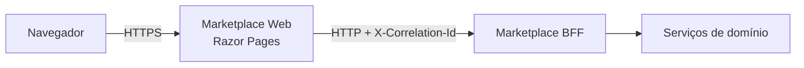

# Marketplace Web

Documentação do microserviço **Marketplace Web**, uma aplicação web server-side em ASP.NET Core Razor Pages responsável pela experiência de navegação, checkout e acompanhamento de pedidos do marketplace. A aplicação consome o BFF do marketplace por HTTP e propaga o identificador de correlação das requisições.

A referência arquitetural canônica deste projeto é o repositório [`leandrosflora/logistica-envios-demo-arch`](https://github.com/leandrosflora/logistica-envios-demo-arch). Os endpoints do BFF abaixo seguem a documentação de `docs/contracts/logistica-envios-apis.openapi.yaml` desse repositório.

## Sumário

- [Visão geral](#visão-geral)
- [Responsabilidades](#responsabilidades)
- [Tecnologias e dependências](#tecnologias-e-dependências)
- [Arquitetura interna](#arquitetura-interna)
- [Fluxos funcionais](#fluxos-funcionais)
- [Integração com o BFF](#integração-com-o-bff)
- [Acesso às páginas](#acesso-às-páginas)
- [Configuração](#configuração)
- [Executando localmente](#executando-localmente)
- [Validação e build](#validação-e-build)
- [Estrutura de diretórios](#estrutura-de-diretórios)
- [Contratos de dados](#contratos-de-dados)
- [Resiliência, observabilidade e segurança](#resiliência-observabilidade-e-segurança)
- [Operação e troubleshooting](#operação-e-troubleshooting)
- [Evolução sugerida](#evolução-sugerida)

## Visão geral

O Marketplace Web é o frontend web do marketplace. Ele renderiza páginas Razor no servidor e delega regras transacionais para o BFF configurado em `Bff:BaseUrl`.

Principais características:

- Aplicação ASP.NET Core 8.0 com Razor Pages.
- Consumo do BFF via `HttpClient` tipado.
- Propagação/criação de `X-Correlation-Id` para rastreabilidade entre serviços.
- Políticas de resiliência com timeout, retry e circuit breaker.
- Proteção antifalsificação de requisições habilitada globalmente para formulários.

## Responsabilidades

Este microserviço é responsável por:

1. **Renderizar a experiência web do comprador**
   - Página inicial.
   - Detalhe de produto.
   - Revisão de checkout.
   - Detalhe e rastreamento de pedido.

2. **Orquestrar chamadas ao BFF a partir da interface**
   - Obter dados de produto e frete.
   - Obter dados de checkout.
   - Confirmar checkout.
   - Obter dados de pedido.
   - Solicitar cancelamento de pedido.

Este serviço **não** deve concentrar regras de negócio centrais do marketplace. Validação transacional, precificação final, disponibilidade, autorização de operações e consistência dos pedidos permanecem fora do frontend e devem ficar no BFF e nos serviços de domínio correspondentes.

## Tecnologias e dependências

| Item | Uso |
| --- | --- |
| .NET 8.0 | Framework-alvo da aplicação. |
| ASP.NET Core Razor Pages | Renderização server-side das páginas. |
| Microsoft.Extensions.Http.Resilience | Políticas resilientes para chamadas HTTP ao BFF. |
| Bootstrap, jQuery e validação unobtrusive | Recursos estáticos de interface presentes em `wwwroot`. |

Pacotes NuGet declarados:

- `Microsoft.Extensions.Http.Resilience` versão `8.0.*`.

## Arquitetura interna



### Componentes principais

- `Program.cs`
  - Registra Razor Pages.
  - Registra handlers HTTP de correlação.
  - Registra `IMarketplaceBffClient` com resiliência.
  - Monta o pipeline HTTP da aplicação.

- `Clients/MarketplaceBffClient.cs`
  - Implementa o cliente tipado para o BFF.
  - Converte chamadas de página em requisições HTTP.
  - Trata `404 Not Found` como resposta nula para telas de detalhe.
  - Converte erros do BFF em `BffApiException` usando `ProblemDetails` quando disponível.

- `Infrastructure/CorrelationIdHandler.cs`
  - Reaproveita o `X-Correlation-Id` recebido, quando presente.
  - Caso contrário, usa `TraceIdentifier` da requisição atual.
  - Em último caso, gera um novo GUID sem separadores.

- `Contracts/*.cs`
  - Define os modelos de entrada e saída trocados entre a aplicação web e o BFF.

- `Pages/**/*.cshtml` e `Pages/**/*.cshtml.cs`
  - Implementam as telas e seus PageModels.

## Fluxos funcionais

### 1. Visualização de produto

Rota: `GET /Products/Details/{id}`

1. A página aceita o `skuId` pela rota, quantidade e CEP por query string.
2. A quantidade é limitada ao intervalo de 1 a 99.
3. O CEP é normalizado para apenas dígitos e aceito somente quando possui 8 números.
4. A aplicação chama o BFF para buscar dados de produto e promessa de frete.
5. Se o BFF retornar `404`, a página responde `NotFound`.
6. A tela exibe preço, categoria, disponibilidade, frete, alertas e botão de compra.

Chamada BFF:

```http
GET /api/web/v1/products/{skuId}/page?quantity={quantity}&zipCode={zipCode}
```

### 2. Busca textual de produtos

Rota: `GET /Search?query={texto}`

1. A página normaliza o texto pesquisado e limita o valor a 100 caracteres.
2. A aplicação chama o endpoint documentado de busca textual do BFF.
3. O BFF pode receber paginação, CEP e região, conforme o contrato canônico; a tela atual envia somente `query` e usa os padrões do BFF para os demais parâmetros.
4. A tela exibe produtos retornados, status de disponibilidade e score quando informado.

Chamada BFF:

```http
GET /api/web/v1/products/search?query={texto}&page={page}&pageSize={pageSize}&zipCode={zipCode}&region={region}
```

### 3. Revisão de checkout

Rota: `GET /Checkout/Review?checkoutId={checkoutId}`

1. A rota está protegida por autenticação.
2. A aplicação busca o checkout no BFF.
3. Os dados de entrega selecionada e cotação são carregados em campos ocultos do formulário.
4. Uma chave de idempotência é gerada para a confirmação.
5. A tela exibe itens, frete e total.

Chamada BFF:

```http
GET /api/web/v1/checkouts/{checkoutId}
```

### 4. Confirmação de compra

Rota: `POST /Checkout/Review?handler=Confirm`

1. O formulário envia os dados do checkout e a chave de idempotência.
2. A aplicação chama o BFF para confirmar a compra.
3. O cabeçalho `Idempotency-Key` é enviado para evitar confirmação duplicada.
4. Em sucesso, o usuário é redirecionado para o detalhe do pedido.
5. Em erro retornado pelo BFF, a mensagem é adicionada ao `ModelState` e a tela é renderizada novamente.

Chamada BFF:

```http
POST /api/web/v1/checkouts/{checkoutId}/confirm
Idempotency-Key: {idempotencyKey}
Content-Type: application/json

{
  "shippingPromiseId": "...",
  "pricingQuoteId": "...",
  "paymentMethodToken": "..."
}
```

### 5. Detalhe e rastreamento de pedido

Rota: `GET /Orders/Details/{id}`

1. A rota está protegida por autenticação.
2. A aplicação busca o pedido no BFF.
3. A tela exibe status, totais, entrega, código de rastreio e linha do tempo de eventos.
4. Warnings retornados pelo BFF são renderizados como alertas.

Chamada BFF:

```http
GET /api/web/v1/orders/{orderId}
```

### 6. Cancelamento de pedido

Rota: `POST /Orders/Details/{id}?handler=Cancel`

1. A tela envia solicitação de cancelamento para o BFF.
2. A chave de idempotência é lida do cabeçalho `Idempotency-Key` quando fornecida ou gerada automaticamente.
3. Em sucesso, a aplicação redireciona para o mesmo detalhe do pedido com mensagem em `TempData`.
4. Em erro, a mensagem do BFF é exibida no sumário de validação.

Chamada BFF:

```http
POST /api/web/v1/orders/{orderId}/cancel
Idempotency-Key: {idempotencyKey}
Content-Type: application/json

{
  "reason": "Cancelado pelo comprador"
}
```

## Integração com o BFF

A URL base do BFF é configurada em `Bff:BaseUrl`. O valor padrão em `appsettings.json` aponta para:

```json
{
  "Bff": {
    "BaseUrl": "https://localhost:7229"
  }
}
```

### Cliente tipado

O serviço registra `IMarketplaceBffClient` como cliente HTTP tipado. Todas as chamadas ao BFF passam pela seguinte cadeia:

1. `CorrelationIdHandler` adiciona `X-Correlation-Id`.
2. Políticas de resiliência do `AddStandardResilienceHandler` controlam timeout, retry e circuit breaker.
3. `MarketplaceBffClient` serializa ou desserializa JSON e trata erros.

### Endpoints consumidos

| Operação | Método | Caminho |
| --- | --- | --- |
| Buscar produtos | `GET` | `/api/web/v1/products/search` |
| Obter produto | `GET` | `/api/web/v1/products/{skuId}` |
| Página de produto | `GET` | `/api/web/v1/products/{skuId}/page` |
| Calcular promessa de frete | `POST` | `/api/web/v1/shipping-promises` |
| Criar checkout | `POST` | `/api/web/v1/checkouts` |
| Obter checkout | `GET` | `/api/web/v1/checkouts/{checkoutId}` |
| Confirmar checkout | `POST` | `/api/web/v1/checkouts/{checkoutId}/confirm` |
| Obter pedido | `GET` | `/api/web/v1/orders/{orderId}` |
| Cancelar pedido | `POST` | `/api/web/v1/orders/{orderId}/cancel` |
| Obter tracking do pedido | `GET` | `/api/web/v1/orders/{orderId}/tracking` |
| Obter etiqueta de shipment | `GET` | `/api/web/v1/shipments/{shipmentId}/label` |

## Acesso às páginas

Neste momento o frontend não registra autenticação/autorização própria. As páginas de navegação, checkout e pedidos ficam acessíveis diretamente para facilitar os testes das integrações com o BFF.

| Área | Acesso |
| --- | --- |
| `/Index` | Público |
| `/Products/*` | Público |
| `/Checkout/*` | Público |
| `/Orders/*` | Público |

## Configuração

### `appsettings.json`

| Chave | Descrição | Exemplo |
| --- | --- | --- |
| `Bff:BaseUrl` | URL base do Marketplace BFF. | `https://localhost:7229` |
| `Logging:LogLevel:*` | Níveis de log da aplicação e bibliotecas. | `Information`, `Warning` |
| `AllowedHosts` | Hosts aceitos pelo ASP.NET Core. | `*` |

### Variáveis de ambiente recomendadas

Em ambientes de desenvolvimento, homologação ou produção, prefira sobrescrever valores por variáveis de ambiente:

```bash
export ASPNETCORE_ENVIRONMENT=Development
export Bff__BaseUrl="https://localhost:7229"
```

## Executando localmente

### Pré-requisitos

- SDK do .NET 8 instalado.
- Marketplace BFF disponível na URL configurada em `Bff:BaseUrl`.
- Certificado de desenvolvimento HTTPS confiável, caso use o perfil `https`.

### Restaurar dependências

```bash
dotnet restore
```

### Executar com perfil HTTP

```bash
dotnet run --launch-profile http
```

URL padrão:

```text
http://localhost:5130
```

### Executar com perfil HTTPS

```bash
dotnet run --launch-profile https
```

URLs padrão:

```text
https://localhost:7023
http://localhost:5130
```

### Ajustar o BFF local

Se o BFF estiver em outra porta, sobrescreva a configuração:

```bash
dotnet run --launch-profile https -- Bff:BaseUrl=https://localhost:7229
```

Ou use variável de ambiente:

```bash
export Bff__BaseUrl="https://localhost:7229"
dotnet run --launch-profile https
```

## Validação e build

Comandos recomendados antes de abrir pull request:

```bash
dotnet restore
dotnet build --no-restore
```

Caso sejam adicionados testes automatizados futuramente, execute também:

```bash
dotnet test
```

## Estrutura de diretórios

```text
MarketplaceWeb/
├── Clients/
│   ├── BffApiException.cs
│   ├── IMarketplaceBffClient.cs
│   └── MarketplaceBffClient.cs
├── Contracts/
│   ├── CheckoutContracts.cs
│   ├── OrderContracts.cs
│   └── ProductContracts.cs
├── Infrastructure/
│   └── CorrelationIdHandler.cs
├── Pages/
│   ├── Checkout/
│   ├── Orders/
│   ├── Products/
│   └── Shared/
├── Properties/
│   └── launchSettings.json
├── wwwroot/
│   ├── css/
│   ├── js/
│   └── lib/
├── appsettings.Development.json
├── appsettings.json
├── MarketplaceWeb.csproj
├── MarketplaceWeb.sln
├── Program.cs
└── README.md
```

## Contratos de dados

### Produto

`ProductPageResponse` contém:

- `Product`: dados básicos do SKU, vendedor, categoria, preço e disponibilidade.
- `Shipping`: resumo opcional de frete, incluindo promessa, modal, data estimada, custo e motivo de indisponibilidade.
- `Warnings`: mensagens de alerta retornadas pelo BFF.

### Checkout

`CheckoutPageResponse` contém:

- Identificador do checkout.
- Totais de itens, frete e valor final.
- Moeda.
- Entrega selecionada.
- Lista de itens.

`ConfirmCheckoutInput` representa os campos do formulário de confirmação:

- `CheckoutId`.
- `ShippingPromiseId`.
- `PricingQuoteId`.
- `PaymentMethodToken`.
- `IdempotencyKey`.

`ConfirmCheckoutRequest` é o corpo enviado ao BFF e não inclui a chave de idempotência, pois ela é enviada por cabeçalho.

### Pedido

`OrderPageResponse` contém:

- `Order`: status e valores do pedido.
- `Shipment`: dados opcionais da remessa.
- `Tracking`: status atual e eventos de rastreamento.
- `Warnings`: alertas retornados pelo BFF.

## Resiliência, observabilidade e segurança

### Resiliência HTTP

O cliente do BFF utiliza `AddStandardResilienceHandler` com:

- Timeout total de requisição: 5 segundos.
- Timeout por tentativa: 2 segundos.
- Até 2 retentativas.
- Circuit breaker com taxa de falha de 50%.
- Throughput mínimo de 20 chamadas.
- Janela de amostragem de 30 segundos.
- Duração de abertura do circuito de 15 segundos.

Atenção: métodos `POST` também passam pelo handler de resiliência. Como operações de confirmação e cancelamento usam `Idempotency-Key`, o BFF deve tratar idempotência corretamente para evitar efeitos duplicados em caso de retry.

### Correlação

Todas as chamadas ao BFF recebem `X-Correlation-Id`. Esse cabeçalho permite correlacionar logs entre navegador, Marketplace Web, BFF e serviços internos.

### Tratamento de erros do BFF

Quando o BFF retorna erro:

1. O cliente tenta desserializar a resposta como `ProblemDetails`.
2. Usa `detail` ou `title` como mensagem amigável.
3. Lança `BffApiException` com o `HttpStatusCode` original.
4. As páginas de checkout e pedido exibem a mensagem no sumário de validação.

### Segurança

Medidas já presentes:

- Antiforgery token validado automaticamente em ações MVC/Razor Pages.
- HSTS habilitado fora do ambiente de desenvolvimento.
- Redirecionamento HTTP para HTTPS.
- Corpo técnico de erro do BFF não é exposto diretamente quando não segue `ProblemDetails`.

Recomendações para produção:

- Restringir `AllowedHosts` aos domínios reais.
- Garantir HTTPS ponta a ponta.
- Configurar políticas de CSP, se aplicável.
- Usar logs estruturados com correlação.
- Monitorar métricas de circuit breaker, latência e status HTTP do BFF.

## Operação e troubleshooting

### Erro: `BFF BaseUrl is not configured`

Causa provável:

- A chave `Bff:BaseUrl` não foi definida.

Solução:

```bash
export Bff__BaseUrl="https://localhost:7229"
dotnet run --launch-profile https
```

### Erros de certificado HTTPS em desenvolvimento

Solução típica:

```bash
dotnet dev-certs https --trust
```

Depois reinicie a aplicação.

### Produto, checkout ou pedido retorna 404

Comportamento esperado:

- Produto inexistente: a página de produto retorna `NotFound`.
- Checkout inexistente: a página de revisão retorna `NotFound`.
- Pedido inexistente: a página de detalhe retorna `NotFound`.

Verifique:

- Se o identificador enviado é um GUID válido.
- Se o BFF está apontando para o ambiente correto.
- Se o BFF está aplicando alguma regra de permissão, escopo ou ambiente que impeça o acesso ao recurso.

## Evolução sugerida

- Adicionar testes automatizados de PageModels e cliente BFF com `HttpMessageHandler` fake.
- Adicionar página real de listagem de pedidos em `/Orders/Index`.
- Adicionar criação de checkout a partir da página de produto, caso o BFF exponha esse endpoint.
- Substituir `payment-token-demo` por integração real com provedor de pagamento/tokenização.
- Adicionar health checks para dependências críticas.
- Adicionar logs estruturados com campos de negócio como `checkoutId`, `orderId` e `skuId`.
- Adicionar política explícita para evitar retry em métodos não idempotentes caso alguma operação futura não tenha `Idempotency-Key`.
- Adicionar Dockerfile e documentação de deploy, caso o serviço seja executado em contêiner.
